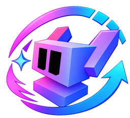

# Optimize Your Project for Blender: v0.7.4



<p align="center">
  <a href="../README.md"><strong>Overview</strong></a> |
  <a href="../Blender/README.md"><strong>Blender Guide</strong></a> |
  <a href="../Documentation/Roadmap.md"><strong>Roadmap</strong></a> |
  <a href="../Documentation/Architecture.md"><strong>Architecture</strong></a> |
  <a href="../CHANGELOG.md"><strong>Changelog</strong></a>
</p>

<p align="center">
  <strong>Interface languages:</strong> English | 日本語 | 简体中文 | 한국어
</p>

<details open>
<summary><strong>Install / Download Optimize Your Project</strong></summary>

### Unity

Open **Window > Package Manager**, press **+**, choose **Add package from git URL**, then paste:

```text
https://github.com/dedzedofficial/Optimize-Your-Project.git
```

For the fixed v0.7.4 release:

```text
https://github.com/dedzedofficial/Optimize-Your-Project.git#v0.7.4
```

### Blender

The Blender build now produces two real ZIP packages:

- **Blender 4.2+ / Blender Extensions:** `optimize-your-project-blender-extension-0.7.4.zip`
- **Blender 3.6 legacy add-on:** `optimize-your-project-blender-0.7.4.zip`

[](https://github.com/dedzedofficial/Optimize-Your-Project/actions/workflows/release-checks.yml)

Open the latest successful **Check release packages** run and download the `optimize-your-project-blender-0.7.4` artifact. It contains both ZIP files. Use the **extension** ZIP for `extensions.blender.org`. The official Blender Extensions listing will replace this temporary download button after publication.

The legacy ZIP also remains available from [GitHub Releases](https://github.com/dedzedofficial/Optimize-Your-Project/releases) when a matching Blender release is published.

### VRChat Creator Companion / VCC

Use [Add Optimize Your Project to VCC](vcc://vpm/addRepo?url=https%3A%2F%2Fdedzedofficial.github.io%2FOptimize-Your-Project%2Findex.json), then add **Optimize Your Project** to the chosen project.

</details>

> **New here?** Start with the [Overview](../README.md). You can read the complete documentation directly on GitHub before installing anything.


Blender support for **Optimize Your Project** now combines fast one-click cleanup, Game-Ready static copies and batch preparation for static meshes. The v0.7.4 sidebar also supports English, Japanese, Simplified Chinese and Korean.

## Install

### Blender 4.2+ / Blender Extensions package

The package intended for Blender 4.2+ and `extensions.blender.org` is:

```text
optimize-your-project-blender-extension-0.7.4.zip
```

Download the `optimize-your-project-blender-0.7.4` artifact from the latest successful [Check release packages](https://github.com/dedzedofficial/Optimize-Your-Project/actions/workflows/release-checks.yml) run. The artifact contains the extension ZIP above plus the Blender 3.6 legacy ZIP.

For a local install in Blender 4.2+, use **Edit > Preferences > Get Extensions > Install from Disk** and choose the extension ZIP.

### Blender 3.6 legacy package

Use:

```text
optimize-your-project-blender-0.7.4.zip
```

Then use **Edit > Preferences > Add-ons > Install...**, enable **Optimize Your Project for Blender**, press **N** in the 3D Viewport and open the **FISHHWB** tab.

### Official Blender Extensions listing

The final GitHub install button will point directly to the official Blender Extensions listing after it is published. The extension ZIP above is the submission package for that listing.

The Blender extension package is licensed under **GPL-3.0-or-later**, as required for add-ons submitted to Blender Extensions. The repository's non-Blender portions retain their existing licensing.

## One-click cleanup

Select one static mesh in Object Mode.

### Clean Selected Mesh

Press **Clean Selected Mesh** to process the active mesh and select a separate `_Clean` copy in Object Mode. Existing names get a numbered suffix such as `_Clean_001`. Other selected objects are not processed.

The button merges vertices at exactly equal coordinates, removes zero-area faces, loose edges and isolated vertices, then removes unused material slots. It recalculates normals only on closed manifold components. Valid disconnected faces and open surfaces are kept, including their winding. UVs and used material assignments are retained. The original object and mesh data are untouched.

The tool refuses shape keys, vertex groups, rigs, modifiers, linked/overridden data, custom split normals, empty meshes and non-finite coordinates with a reason. Make a separate static copy and resolve these conditions first. Loose lines and points are removed intentionally, so compare the result before replacing an asset that uses them.

The **Last Result** panel reports object outcomes plus vertices removed, exact duplicates merged, loose edges removed, zero-area faces removed, material slots removed and faces reoriented. Duplicate counts are part of the total removed vertices, not an additional total. A clean mesh reports **Unchanged** even though an output copy is created. Failures discard the incomplete copy and restore the original selection.

### Create Game-Ready Copy

Press **Create Game-Ready Copy** on a supported static mesh. The add-on creates a separate `_GameReady` object and keeps the original unchanged.

When **Apply Existing Modifiers** is enabled, modifiers are evaluated onto the new copy. The copy then applies rotation and scale, performs the conservative cleanup pass, removes unused material slots and reports the resulting triangle count. Rigged meshes, shape keys, vertex groups, linked data and custom split normals are skipped instead of being flattened silently.

### One-Click Remesh

Press **One-Click Remesh**. The add-on creates a new `_Remesh` copy and automatically chooses a practical remesh detail size from the mesh dimensions.

This is intended for static props and cleanup meshes. Rigged, vertex-group, armature, and shape-key meshes are skipped because remeshing changes topology.

### Merge Duplicate Vertices

Set **Merge Distance** and press **Merge Duplicate Vertices**. The add-on creates a new `_Merged` copy and welds nearby vertices.

Shape-key meshes are skipped to avoid breaking topology-dependent keys.

## Batch mesh preparation

Select multiple mesh objects in Object Mode.

- **Clean Selected Meshes** creates a separate cleaned copy for every supported selected static mesh. Unsupported topology-sensitive meshes are skipped and the originals stay untouched.
- **Create LODs for Selection** runs the guarded LOD0 / LOD1 / LOD2 workflow across supported selected static meshes.
- **Show Heavy Meshes** selects scene mesh objects above the configured triangle threshold so high-cost geometry is easier to find.

## Interface languages

Use the **Language** control at the top of the sidebar. v0.7.4 includes English, Japanese, Simplified Chinese and Korean for the main Blender workflow. Future language additions are tracked in the project roadmap.

## Advanced Mesh Tools

The earlier preview tools are still available below the quick section:

- **Create Reduced Copy**: decimated duplicate under a triangle limit.
- **Join Selected and Merge Vertices**: joins selected mesh copies and welds nearby vertices.
- **Merge Base Color Textures + UVs**: optional supported Base Color atlas path for the join tool.
- **Create LOD0 / LOD1 / LOD2**: static mesh copies at 100%, up to 66%, and up to 33% triangle counts.

These tools create output copies so the source object remains available for comparison.

## Notes

Blender v0.7.4 is early support. Test generated meshes before replacing production assets, especially before GLB/FBX export into Unity or another engine.
